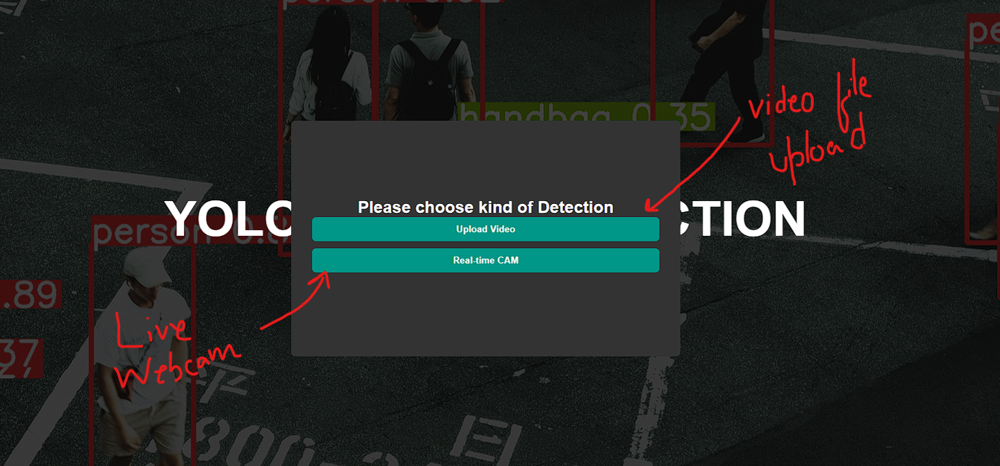
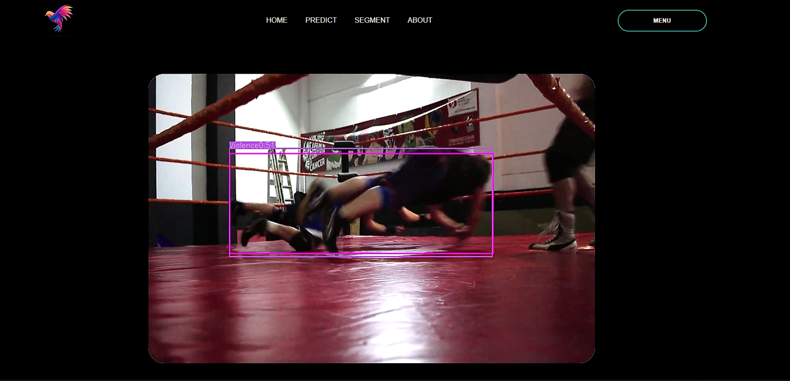
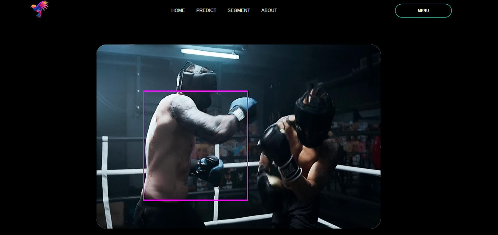
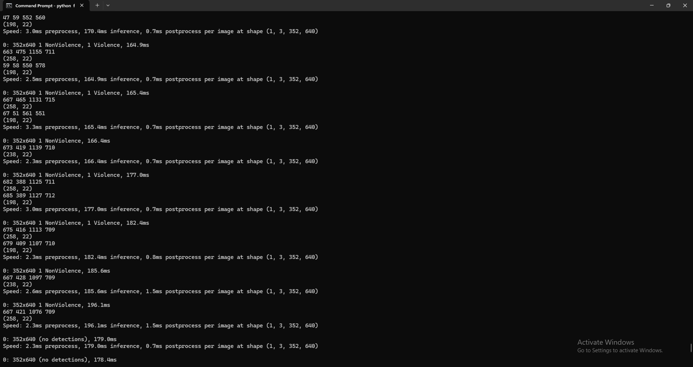

# Violence Detection System

## Overview
The primary objective of this violence detection system is to build an automated solution for detecting violent activities and dangerous objects (such as violence, guns, and knives) in both real-time camera feeds and video uploads. The system utilizes a robust object detection model, **YOLOv8**, trained on a custom dataset.

## Current Implementation
Currently, the project employs **YOLOv8** for detection. Below are some screenshots demonstrating its performance:







## Features
- **Video Upload**: Users can upload a desired video and analyze its output.
- **Real-Time Detection**: Uses a real-time camera or webcam to detect violent activities in live feeds.

## Setup Instructions

### 1. Create a Virtual Environment
Before running the project, create a Python virtual environment:
```sh
python -m venv venv
source venv/bin/activate  # On macOS/Linux
venv\Scripts\activate    # On Windows
```

### 2. Install Dependencies
Install the required dependencies by running:
```sh
pip install -r requirements.txt
```

### 3. Run the Flask Application
Start the Flask application by executing:
```sh
python flaskAPP.py
```
This will open the web app in your default web browser, allowing users to choose between **real-time detection** or **video upload analysis**.

## YOLOv8 Model Variants
Different YOLOv8 models provide varying levels of accuracy and speed. Listed below from lightest to heaviest:
- **YOLOv8n** (nano)
- **YOLOv8s** (small)
- **YOLOv8m** (medium)
- **YOLOv8l** (large)
- **YOLOv8x** (extra-large, highest accuracy)

## Limitations & Future Work
Currently, the model is not fully optimized due to the limited availability of datasets. However, **YOLOv8** is a powerful detection model, and further improvements can be made with better dataset access.

---

